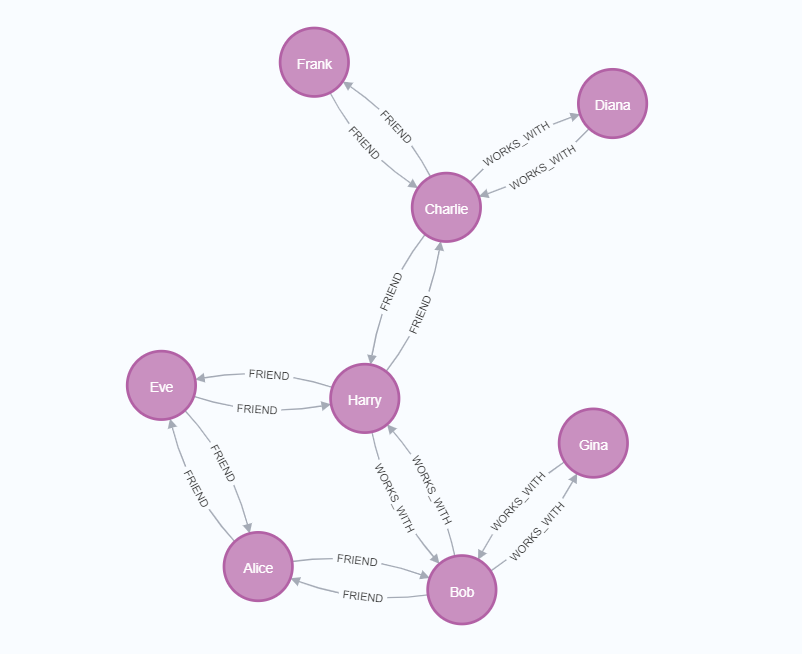

CypherMutant
Automatic generation of mutants for Cypher queries

# Purpose
The purpose of this system is to automatically generate mutant Cypher queries.

# Input and Output
Input: Cypher query (string)
Output: Set of mutants (object)
# Compatibility
This system runs on Linux-based OS. It can also be run on Windows or Mac (not M1 Mac) using Docker.

# Running with Docker
Below is an example command for running with Docker:

```
$ docker build . -t cypher

$ docker run cypher "MATCH (a:Label) RETURN a"

```
# Example Output
```
[INPUT]
  MATCH (a:Label) RETURN a

[OUTPUT]
  KEY : Label on nodes
    MATCH (a) RETURN a

  KEY : MATCH clause
    OPTIONAL MATCH (a:Label) RETURN a

  KEY : NULL in results
    MATCH (a:Label) RETURN CASE WHEN (a IS NULL) THEN 0 ELSE a END

  KEY : RETURN clause
    MATCH (a:Label) RETURN DISTINCT a

4 mutants were generated.
```

# install neo4j
Neo4j is a graph database management system (DBMS) developed by Neo4j.
To install Neo4j, you will first need to download the appropriate installer for your operating system from the Neo4j website. Once the installer has been downloaded, you can run it and follow the prompts to install Neo4j on your system.

You may also need to set up a Java Runtime Environment (JRE) if you do not already have one installed on your system. Neo4j is written in Java, so it requires a JRE to run.

After the installation is finished, you can start the Neo4j server by running the command "neo4j start" in the terminal (or command prompt) and then you can open your browser and type "http://localhost:7474" to access the Neo4j browser where you can interact with the database using Cypher query language.

Please refer to the official documentation for more detailed instructions on how to install Neo4j and set up a JRE if needed.
https://neo4j.com/

# Create a database
```
CREATE (n1:Person {name: "Alice", age: 24, occupation: "Teacher"}),
(n2:Person {name: "Bob", age: 26, occupation: "Engineer"}),
(n3:Person {name: "Charlie", age: 28, occupation: "Lawyer"}),
(n4:Person {name: "Diana", age: 30, occupation: "Doctor"}),
(n5:Person {name: "Eve", age: 32, occupation: "Designer"}),
(n6:Person {name: "Frank", age: 34, occupation: "Artist"}),
(n7:Person {name: "Gina", age: 36, occupation: "Accountant"}),
(n8:Person {name: "Harry", age: 38, occupation: "Architect"})

```

The database created in consists of eight nodes representing individuals with their respective names, ages, and occupations. There are two types of relationships between these nodes: "FRIEND" and "WORKS_WITH".

The commands used to create the database are the CREATE and MATCH statements. The CREATE statement is used to create nodes and relationships between them, while the MATCH statement is used to identify specific nodes or relationships based on their properties.

# Create Relaitonship
```


MATCH (p1:Person),(p2:Person)
WHERE p1.name = "Eve" AND p2.name = "Alice" 
Create (p1)-[:FRIEND]->(p2)
...

MATCH (p1:Person),(p2:Person)
WHERE p1.name = "Harry" AND p2.name = "Alice" 
Create (p1)-[:WORKS_WITH]->(p2) 
...

MATCH (a)-[r:FRIEND]->(b)
CREATE(b)-[:FRIEND]->(a)

MATCH (a)-[r:WORKS_WITH]->(b)
CREATE(b)-[:WORKS_WITH]->(a)


```
These queries are used to create relationships between nodes in a graph database. The first two queries use MATCH and WHERE to find specific nodes based on their properties (name), and then use CREATE to create a relationship between those nodes. The relationship type is specified using the square brackets and a colon, followed by the relationship name (FRIEND or WORKS_WITH). The arrow symbol indicates the direction of the relationship.

The next two queries use MATCH to find relationships between nodes, and then use CREATE to create a new relationship in the opposite direction. This effectively creates a bidirectional relationship, where both nodes are connected to each other.
# visualizaiton
To visualize the database, a graph could be drawn showing the nodes and their relationships in Neo4j Bloom. For example:


# Match node
```
MATCH (p1:Person), (p2:Person) WHERE ((p1.name = 'Eve') AND (p2.name = 'Alice')) RETURN p1, p2
```
The example search query uses MATCH and WHERE to find two specific nodes, p1 and p2, that have the names "Eve" and "Alice" respectively. The RETURN statement then displays the results of the search, which in this case would be the nodes for Eve and Alice.

# Create Mutant
```
docker run cypher "MATCH (p1:Person),(p2:Person) WHERE p1.name = 'Eve' AND p2.name = 'Alice' return p1,p2" 
```
and result
```

[INPUT]
  MATCH (p1:Person), (p2:Person) WHERE ((p1.name = 'Eve') AND (p2.name = 'Alice')) RETURN p1, p2

[OUTPUT]
  KEY : Include NULLs
    MATCH (p1:Person), (p2:Person) WHERE (((p1.name = 'Eve') OR (p1.name IS NULL)) AND (p2.name = 'Alice')) RETURN p1, p2
    MATCH (p1:Person), (p2:Person) WHERE (((p1.name = 'Eve') OR ('Eve' IS NULL)) AND (p2.name = 'Alice')) RETURN p1, p2
    MATCH (p1:Person), (p2:Person) WHERE ((p1.name = 'Eve') AND ((p2.name = 'Alice') OR (p2.name IS NULL))) RETURN p1, p2
    MATCH (p1:Person), (p2:Person) WHERE ((p1.name = 'Eve') AND ((p2.name = 'Alice') OR ('Alice' IS NULL))) RETURN p1, p2

  KEY : Relational operator
    MATCH (p1:Person), (p2:Person) WHERE ((p1.name <> 'Eve') AND (p2.name = 'Alice')) RETURN p1, p2
    MATCH (p1:Person), (p2:Person) WHERE ((p1.name < 'Eve') AND (p2.name = 'Alice')) RETURN p1, p2
    MATCH (p1:Person), (p2:Person) WHERE ((p1.name > 'Eve') AND (p2.name = 'Alice')) RETURN p1, p2
    MATCH (p1:Person), (p2:Person) WHERE ((p1.name <= 'Eve') AND (p2.name = 'Alice')) RETURN p1, p2
    MATCH (p1:Person), (p2:Person) WHERE ((p1.name >= 'Eve') AND (p2.name = 'Alice')) RETURN p1, p2
    MATCH (p1:Person), (p2:Person) WHERE (TRUE AND (p2.name = 'Alice')) RETURN p1, p2
    MATCH (p1:Person), (p2:Person) WHERE (FALSE AND (p2.name = 'Alice')) RETURN p1, p2
    MATCH (p1:Person), (p2:Person) WHERE ((p1.name = 'Eve') AND (p2.name <> 'Alice')) RETURN p1, p2
    MATCH (p1:Person), (p2:Person) WHERE ((p1.name = 'Eve') AND (p2.name < 'Alice')) RETURN p1, p2
    MATCH (p1:Person), (p2:Person) WHERE ((p1.name = 'Eve') AND (p2.name > 'Alice')) RETURN p1, p2
    MATCH (p1:Person), (p2:Person) WHERE ((p1.name = 'Eve') AND (p2.name <= 'Alice')) RETURN p1, p2
    MATCH (p1:Person), (p2:Person) WHERE ((p1.name = 'Eve') AND (p2.name >= 'Alice')) RETURN p1, p2
    MATCH (p1:Person), (p2:Person) WHERE ((p1.name = 'Eve') AND TRUE) RETURN p1, p2
    MATCH (p1:Person), (p2:Person) WHERE ((p1.name = 'Eve') AND FALSE) RETURN p1, p2

  KEY : Logical operator
    MATCH (p1:Person), (p2:Person) WHERE ((p1.name = 'Eve') OR (p2.name = 'Alice')) RETURN p1, p2
    MATCH (p1:Person), (p2:Person) WHERE ((p1.name = 'Eve') XOR (p2.name = 'Alice')) RETURN p1, p2
    MATCH (p1:Person), (p2:Person) WHERE TRUE RETURN p1, p2
    MATCH (p1:Person), (p2:Person) WHERE FALSE RETURN p1, p2
    MATCH (p1:Person), (p2:Person) WHERE (p1.name = 'Eve') RETURN p1, p2
    MATCH (p1:Person), (p2:Person) WHERE (p2.name = 'Alice') RETURN p1, p2

  KEY : Label on nodes
    MATCH (p1), (p2:Person) WHERE ((p1.name = 'Eve') AND (p2.name = 'Alice')) RETURN p1, p2
    MATCH (p1:Person), (p2) WHERE ((p1.name = 'Eve') AND (p2.name = 'Alice')) RETURN p1, p2

  KEY : MATCH clause
    OPTIONAL MATCH (p1:Person), (p2:Person) WHERE ((p1.name = 'Eve') AND (p2.name = 'Alice')) RETURN p1, p2

  KEY : NULL in results
    MATCH (p1:Person), (p2:Person) WHERE ((p1.name = 'Eve') AND (p2.name = 'Alice')) RETURN CASE WHEN (p1 IS NULL) THEN 0 ELSE p1 END, p2
    MATCH (p1:Person), (p2:Person) WHERE ((p1.name = 'Eve') AND (p2.name = 'Alice')) RETURN p1, CASE WHEN (p2 IS NULL) THEN 0 ELSE p2 END

  KEY : RETURN clause
    MATCH (p1:Person), (p2:Person) WHERE ((p1.name = 'Eve') AND (p2.name = 'Alice')) RETURN DISTINCT p1, p2

30 mutants were generated.
```


# Result 
```
 MATCH (p1:Person), (p2:Person) WHERE (((p1.name = 'Eve') OR (p1.name IS NULL)) AND (p2.name = 'Alice')) RETURN p1, p2
```

```
MATCH (p1:Person), (p2:Person) WHERE ((p1.name <> 'Eve') AND (p2.name = 'Alice')) RETURN p1, p2
```

```
MATCH (p1:Person), (p2:Person) WHERE (FALSE AND (p2.name = 'Alice')) RETURN p1, p2
```
(no changes, no records)
```
MATCH (p1:Person), (p2:Person) WHERE (TRUE AND (p2.name = 'Alice')) RETURN p1, p2
```


```
MATCH (p1:Person), (p2:Person) WHERE ((p1.name = 'Eve') OR (p2.name = 'Alice')) RETURN p1, p2
```

```
MATCH (p1:Person), (p2) WHERE ((p1.name = 'Eve') AND (p2.name = 'Alice')) RETURN p1, p2
```

